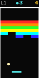
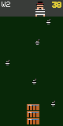

# Axiometa Projects

Welcome to the **Axiometa** project repository. This folder hosts software programs, ports, custom systems, and experiments built for the Axiometa microcontroller ecosystem.

## Projects

### 🕹️ Breakout ([breakout.ino](file:///Users/hectorg/Data/Code/axiometa/breakout.ino))

An Atari 2600-style brick-smashing game adapted for a portrait-oriented screen. Clear all the bricks to advance to the next level while the ball speeds up over time.



*   **Gameplay**: Turn the rotary encoder to move the paddle, and press the tactile button to launch the ball. You start with three lives.
*   **Hardware Setup**:
    *   **P1**: ST7735 LCD Display (`CS=P1_IO0`, `RST=P1_IO1`, `DC=P1_IO2`)
    *   **P2**: Passive Buzzer (`Signal=P2_IO1`)
    *   **P3**: Tactile LED Button (`Button=P3_IO1`, `LED=P3_IO2`)
    *   **P4**: Rotary Encoder (`BTN=P4_IO0`, `CLK=P4_IO1`, `DT=P4_IO2`)

---

### 💣 Kaboom! ([kaboom.ino](file:///Users/hectorg/Data/Code/axiometa/kaboom.ino))

An Atari 2600-style bomb-catching game. A Mad Bomber roams the top of the screen dropping bombs, and you must catch them before they hit the ground.



*   **Gameplay**: Turn the rotary encoder to move a stack of water buckets to catch falling bombs. Press the tactile button to start or restart a round.
*   **Hardware Setup**:
    *   **P1**: ST7735 LCD Display (`CS=P1_IO0`, `RST=P1_IO1`, `DC=P1_IO2`)
    *   **P2**: Passive Buzzer (`Signal=P2_IO1`)
    *   **P3**: Tactile LED Button (`Button=P3_IO1`, `LED=P3_IO2`)
    *   **P4**: Rotary Encoder (`BTN=P4_IO0`, `CLK=P4_IO1`, `DT=P4_IO2`)

---

## Global Dependencies

These firmware projects rely on the following standard Arduino libraries:
- [Adafruit_GFX](https://github.com/adafruit/Adafruit-GFX-Library)
- [Adafruit_ST7735](https://github.com/adafruit/Adafruit-ST7735-Library)
- [RotaryEncoder](https://github.com/mathertel/RotaryEncoder) (by Matthias Hertel)

---

## Capturing Screenshots

Both games support a built-in screen dump utility that allows you to take direct, pixel-perfect screenshots of the gameplay or menus via the USB-Serial connection:

1.  **Trigger on Device**: Double-click the **tactile button** or press the **rotary encoder button twice** at any point during gameplay or on a menu screen. This triggers the firmware to dump the current frame buffer (`80x160` pixels) over Serial.
2.  **Receive on Mac**: Run the Python receiver script on your Mac to listen for dumps, process the RGB565 data, and save screenshots as `.png` files.

### Running the Screenshot Script
Ensure you have the required Python libraries installed:
```bash
pip install pyserial Pillow
```

Run the script from the root of the repository:
```bash
./scripts/screenshot.py
```

*Options:*
- Use `--port <port>` if the script cannot auto-detect your board's serial port.
- Add `--swap-rgb` if the colors of the saved screenshots look reversed on your PC.
